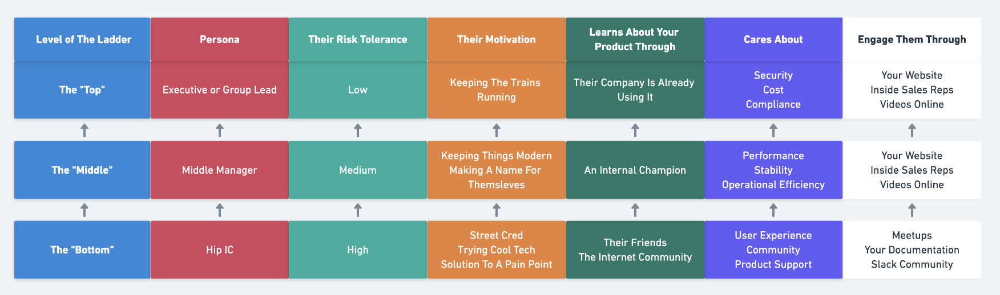

# Thoughts On Product Marketing For Bottoms Up Infra

## High Level Market Changes
To kick things off, I think it’s important to cover a few high level trends that have really changed buying behavior in recent years. These shifts have required a relatively deep re-thinking of product marketing, and require throwing out a good bit of historical wisdom. The marketing role has changed a lot more generally (become much more scientific and metrics driven), but we’ll stick to product marketing for this doc. 

Fundamentally, I think the changes outlined below are the result of a combination of the internet + a generational change in middle management, and mostly boil down to the fact that people just do not want to be “sold to” in the traditional sense anymore. We had a lot of reps that came from legacy companies like Oracle while I was at MemSQL, and I don’t think many of them fully appreciated the changes below. I saw firsthand how painful that ended up being on our ability to sell, and we ended up churning a lot of those reps.

The key changes are: 

- **People Will Self Educate** -- Whether it’s purchasing consumer products from Amazon or software from a vendor, buying behavior has changed dramatically over the past 10 years. Consider even a large purchase, like buying a car. 15 years ago you would go to the dealership and ask someone to walk you through options, get a brochure, etc. Today, you would likely do all of your research online (read reviews, look at options) and come in for a test drive + to get the last 10% of your questions around the particular add ons answered. By the time you go to the dealer, you more or less know you want to buy the car. Software purchasing is very much the same, especially when selling to engineers. 

- **The Market Is Much More Crowded And Competitive** -- Because of the influx of available venture capital in recent years, the infrastructure market has become much, much more crowded. Getting noticed has become much more difficult, and it takes a lot more creativity to cut through the noise.

- **You Have To Deposition Cloud Vendors** -- This is a battle you will fight for forever. Because teams often have budgets allocated to general AWS spend, it means that it does not require budget approval to buy Simple Workflow Service. This makes the Amazon/Azure/GCP services the path of least resistance. Leveraging the Amazon/Azure/GCP marketplaces is one way to combat this, as it allows customers to use their existing AWS/Azure/GCP budget to buy your product. You also have to make sure your licensing is in order so that Amazon does not offer a managed service version of your product.

- **Sales Are Champion Led** -- Product Marketing for Open Source software is notoriously difficult and really unlike any other sector. Because your buyer is usually both analytical and well informed (and you have a free option), marketing open source is fundamentally different from marketing productivity/SaaS/traditional closed source software. It is often the case that a company is already using your product in some capacity when a buying conversation begins, so you need to focus on arming the champion (developer) with the tools they need to make the case to their boss that a purchase makes sense. This champion enablement is critical for moving from the “bottom” to the “middle” and eventually the “enterprise”. 

## A Framework For Understanding Personas
Much like product development, the first thing to understand in product marketing is the relevant personas. In product development, your fundamental goal is to build features that resonate with a user need. In product marketing, your fundamental goal is to build a message that resonates with a buyer need. These are sometimes one in the same, but often they are different. 

In the case of open source, there are three key personas to keep in mind:

#### "Bottom" (Developers)
- **Cares About:** Usability, stability, “street cred” with their friends for using the cool new tool, product support. Above all, an antidote to a day to day pain and suffering -- this group feels it most acutely. 

- **Engages Through:** Documentation, Slack, Hackernews, Meetups, their friends.

- **Risk Tolerance:** High. Wants to work with the newest and coolest technology and is willing to try new things to ease pain. 

#### "Middle" (Directors/VPs)
	
- **Cares About:** Operational efficiency, performance, stability (less outages), and making a name for themselves.

- **Engages Through:** Your website, inside sales representatives, recorded videos from events, *a champion developer in their org*.

- **Risk Tolerance:** Medium. Has to take product risk into account, but sees opportunity to improve their team and advance their career. 

#### "Top" (Procurement/Senior Executive/CIO)
- **Cares About:** They care about all the checkboxes, security, compliance, and adherence to company policies ("does it integrate with X)'.

- **Engages Through:** Outside Sales representatives, sales enablement materials.

- **Risk Tolerance:** Varies depending on organization, but generally low. 
Usually making a large buying decision and big standardization across the org, so the product really needs to work.

## The Goal Of Product Marketing: Clarity and Trust
**The overarching goal of product marketing is to build clarity and trust.**

It is not to try and sell your product, over promise, or use buzz words to drive website traffic (note that this is still a *super* critical marketing activity, but is best left to community marketing and demand gen vs product marketing). Website traffic, like Github stars, is a vanity metric that indicates passive interest rather than active engagement. Your goal with product marketing is not eyeballs, it’s what to do with those eyeballs once you have them. In general, this means downloads and efficient sales. Claiming your product can do things that it can’t will just result in wasted time for your sales team and a poor customer experience overall. Similarly, painting too broad a picture (even if true) of your product’s use cases will just muddle sales conversations and make ramping salespeople super painful. It may seem like narrowing use cases will hurt sales, but it will actually help them. A sales team is not going to understand your product in the depth that you do, so it’s important to narrow things down into a repeatable process. 

With all of this in mind, the goal of product marketing should be to provide your customers with the tools they need to understand what your product is and why they should trust it. Customers should be able to self educate and quickly come up to speed on whether or not your product is a right fit without the need to interact with a member of the sales team. If it is a good fit, they should feel like you are an organization they can trust to deliver. 

There are many nuances to this, but the four most important things to define are:
- **Who Your Product Is For**: This is subtle, but critical. Many companies try to market to too many different roles, which creates confusion. In the early days it is important to choose one user persona and grow out from there. Figma has done an amazing job with this, starting with designers and growing into the entire organization. 

- **What Your Product Is**: Clearly defining the use cases that are a good fit for your product.

- **What Your Product Is Not**: Clearly defining the use cases that are not a good fit for your product.

- **What Pain Your Product Alleviates**: If the use cases are a good fit, defining this product makes the customer’s life less painful/stressful/annoying. 

- **The Use Cases Your Product Solves**: Provide abstract use cases to help customers wrap their head around things. 

- **Concrete Examples**: Give concrete case studies and examples that prove your product works and the pain that it saved those customers.  

### The Strategic Key For Early Open Source: Targeting Middle Managers
The demographic you target with your product marketing will change dramatically as you grow, but it’s my opinion that the key to success in open source product marketing at the medium-early stage (i.e. after you have solid developer awareness) is to go after middle management. This generally looks like Directors and VP’s of Engineering. These are people that have enough power to purchase software for their team or group, but not so much power that they can buy an ELA for the product or mandate that the entire organization standardize on it. Middle managers are the “team” portion of the Developer → Team → Enterprise model of open source expansion. 

In the early days, community marketing/developer advocacy will handle the bottom (developers), and the very top (large Enterprises) is likely a ways off in the future. Developers will read your documentation, and enterprises will speak to your outside sales people directly. The goal of product marketing should be to attack the middle group that doesn’t make economic sense to attack with an outside sales team (given their contract sizes), and probably doesn’t want to engage with a high touch sales process anyhow. They are the Goldilocks “just right” group for your product marketing -- not so big that they need in-person/high touch service, not so small that they don’t have buying power. Because open source companies have strong developer DNA internally, the value of marketing to this group is often missed, but it is critically important. Open source success is largely predicated on a land and expand strategy (average lands look something like $30k), and a single team (led by a middle manager) is almost always where you land.

As such, we need to create a product marketing strategy that:

1. Allows Middle Managers to self educate with minimal sales interaction.
2. Provides your developer champion the tools they need to make their case to their boss in the event that said boss does not wish to educate themselves. 

Following this strategy allows customers to educate themselves fully before they approach your team for a sale. Like the car analogy, the customer may have a few questions they would like clarification on before buying, but these questions can often be served by a small, inexpensive inside sales team rather than requiring the heavy lift of an outbound AE + SE combo. This makes for an incredibly efficient sales motion, and is why product led and open source companies are so resilient to economic shifts like the one we are currently living through. 
